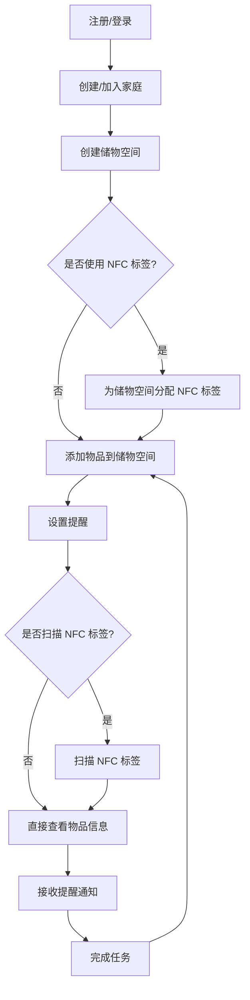

## 1. Product Overview
运营小家是一款家庭物品管理与生活提醒的智能助手，通过 NFC 技术实现物品智能化管理，帮助用户高效管理家庭仓储和生活任务。
- 主要解决家庭物品管理混乱、重要日期遗忘、任务分配不清晰等问题，目标用户为家庭成员，尤其是负责家庭管理的用户。
- 产品价值在于提升家庭管理效率，减少物品浪费，确保重要事项不被遗忘。

## 2. Core Features

### 2.1 User Roles
| Role | Registration Method | Core Permissions |
|------|---------------------|------------------|
| 家庭成员 | 邮箱/手机号注册 | 管理个人物品、设置提醒、查看家庭共享信息 |
| 家庭管理员 | 家庭成员升级 | 额外拥有家庭空间管理、成员管理权限 |

### 2.2 Feature Module
1. **首页**：物品概览、提醒中心、快捷操作
2. **物品管理**：储物空间管理、NFC 标签管理、物品列表、物品详情
3. **提醒中心**：重要日期、周期任务、提醒设置
4. **个人中心**：用户信息、家庭管理、设置

### 2.3 Page Details
| Page Name | Module Name | Feature description |
|-----------|-------------|---------------------|
| 首页 | 物品概览 | 显示最近添加的物品、即将过期的物品、物品分类统计 |
| 首页 | 提醒中心 | 显示最近的提醒事项、未完成的任务 |
| 首页 | 快捷操作 | 快速添加物品、快速添加提醒、扫描 NFC 标签 |
| 物品管理 | 储物空间管理 | 创建和管理家庭储物空间，分配名称、位置和描述，支持批量操作 |
| 物品管理 | NFC 标签管理 | 为储物空间分配 NFC 标签（可选），查看标签对应物品清单，批量编辑标签信息 |
| 物品管理 | 物品列表 | 按分类、位置、状态筛选物品，支持搜索功能 |
| 物品管理 | 物品详情 | 查看物品详细信息，包括名称、分类、数量、存放位置、保质期等，支持编辑和删除 |
| 提醒中心 | 重要日期 | 设置家庭重要日期（生日、纪念日、缴费日等），自定义提醒时间和方式，支持重复提醒 |
| 提醒中心 | 周期任务 | 设置每周/每月固定任务，任务分配与完成状态跟踪，任务提醒通知 |
| 提醒中心 | 提醒设置 | 配置提醒方式（弹窗、通知栏、应用内消息），管理提醒权限 |
| 个人中心 | 用户信息 | 查看和编辑个人资料，修改密码 |
| 个人中心 | 家庭管理 | 创建和管理家庭，邀请家庭成员，设置家庭管理员 |
| 个人中心 | 设置 | 应用通用设置，如语言、通知偏好、数据备份等 |

## 3. Core Process
用户使用运营小家 App 的主要流程包括：
1. 用户注册/登录，创建或加入家庭
2. 创建家庭储物空间
3. 为储物空间分配 NFC 标签（可选）
4. 添加物品信息到相应的储物空间
5. 设置重要日期和周期任务
6. 通过扫描 NFC 标签快速查看对应储物空间内的物品信息（如果使用了 NFC 标签）
7. 接收提醒通知，完成任务

## 4. User Interface Design
### 4.1 Design Style
- 主色调：温暖的橙色 (#FF9F45) 和清新的绿色 (#4CAF50)
- 辅助色：浅灰色 (#F5F5F5)、深灰色 (#333333)
- 按钮风格：圆角按钮，带有轻微的阴影效果
- 字体：无衬线字体，主标题 20px，副标题 16px，正文 14px
- 布局风格：卡片式布局，顶部导航栏，底部标签栏
- 图标风格：线性图标，简洁明了

### 4.2 Page Design Overview
| Page Name | Module Name | UI Elements |
|-----------|-------------|-------------|
| 首页 | 物品概览 | 卡片式布局，显示物品数量统计，使用环形图表展示分类占比，色彩鲜明 |
| 首页 | 提醒中心 | 列表式布局，使用不同颜色区分提醒类型，带有倒计时显示 |
| 首页 | 快捷操作 | 圆形图标按钮，位于页面底部，颜色鲜明，带有轻微的动画效果 |
| 物品管理 | 储物空间管理 | 列表式布局，每个储物空间显示名称、位置和物品数量，支持滑动操作和批量编辑 |
| 物品管理 | NFC 标签管理 | 网格布局，每个标签显示对应的储物空间名称和物品数量，支持长按编辑 |
| 物品管理 | 物品列表 | 列表式布局，每个物品显示名称、数量、位置，支持滑动操作 |
| 物品管理 | 物品详情 | 表单布局，清晰展示物品各项信息，编辑按钮位于顶部 |
| 提醒中心 | 重要日期 | 日历式布局，标记重要日期，点击日期查看详情 |
| 提醒中心 | 周期任务 | 列表式布局，显示任务名称、执行时间、负责人，支持拖拽排序 |
| 提醒中心 | 提醒设置 | 开关式控件，分组展示不同提醒设置选项 |
| 个人中心 | 用户信息 | 头像展示，表单式布局，支持修改个人信息 |
| 个人中心 | 家庭管理 | 列表式布局，显示家庭成员，支持添加和管理成员 |
| 个人中心 | 设置 | 列表式布局，分组展示不同设置选项，带有图标标识 |

### 4.3 Responsiveness
- 移动端优先设计，适配不同屏幕尺寸
- 触摸优化，确保按钮和可交互元素大小适合触摸操作
- 横屏模式支持，优化布局以充分利用屏幕空间

### 4.4 3D Scene Guidance
- 无 3D 场景需求