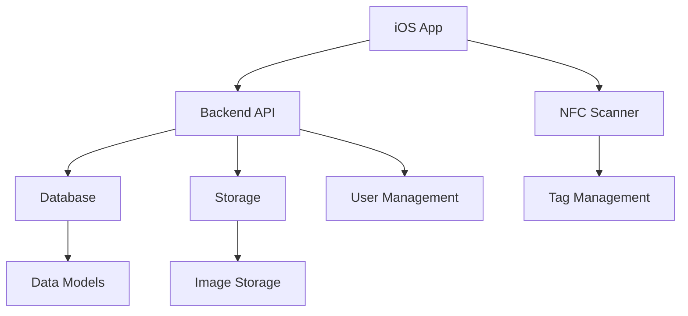
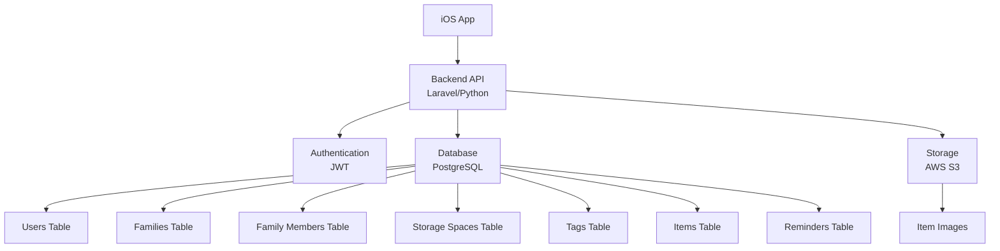
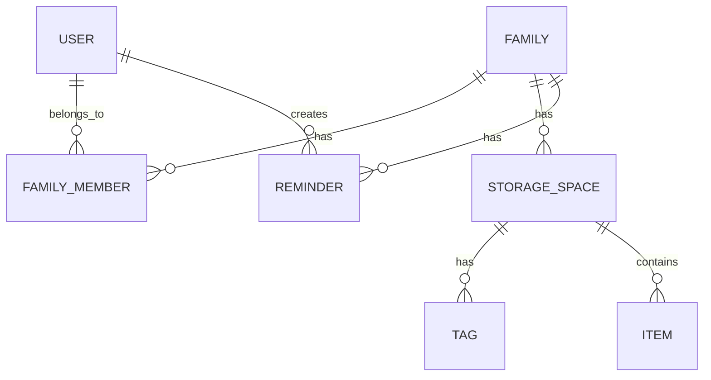

## 1. Architecture Design


## 2. Technology Description
- Frontend: iOS Native App (Swift)
- Backend: Laravel (PHP) or Python (FastAPI)
- Database: PostgreSQL
- NFC Integration: Core NFC (iOS)
- State Management: iOS Native State Management
- Storage: AWS S3 or similar

## 3. API Endpoints
| Endpoint | Method | Purpose |
|----------|--------|---------|
| /api/auth/register | POST | 用户注册 |
| /api/auth/login | POST | 用户登录 |
| /api/auth/logout | POST | 用户登出 |
| /api/auth/me | GET | 获取当前用户信息 |
| /api/families | GET | 获取家庭列表 |
| /api/families | POST | 创建新家庭 |
| /api/families/:id | GET | 获取家庭详情 |
| /api/families/:id | PUT | 更新家庭信息 |
| /api/families/:id | DELETE | 删除家庭 |
| /api/families/:id/members | POST | 添加家庭成员 |
| /api/families/:id/members/:userId | DELETE | 移除家庭成员 |
| /api/storage-spaces | GET | 获取储物空间列表 |
| /api/storage-spaces | POST | 添加新储物空间 |
| /api/storage-spaces/:id | GET | 获取储物空间详情 |
| /api/storage-spaces/:id | PUT | 更新储物空间信息 |
| /api/storage-spaces/:id | DELETE | 删除储物空间 |
| /api/tags | GET | 获取 NFC 标签列表 |
| /api/tags | POST | 添加新 NFC 标签 |
| /api/tags/:id | GET | 获取标签详情 |
| /api/tags/:id | PUT | 更新标签信息 |
| /api/tags/:id | DELETE | 删除标签 |
| /api/items | GET | 获取物品列表 |
| /api/items | POST | 添加新物品 |
| /api/items/:id | GET | 获取物品详情 |
| /api/items/:id | PUT | 更新物品信息 |
| /api/items/:id | DELETE | 删除物品 |
| /api/reminders | GET | 获取提醒列表 |
| /api/reminders | POST | 添加新提醒 |
| /api/reminders/:id | GET | 获取提醒详情 |
| /api/reminders/:id | PUT | 更新提醒信息 |
| /api/reminders/:id | DELETE | 删除提醒 |

## 4. API Definitions
### Authentication API
- POST /api/auth/register - 用户注册
- POST /api/auth/login - 用户登录
- POST /api/auth/logout - 用户登出
- GET /api/auth/me - 获取当前用户信息

### Families API
- GET /api/families - 获取家庭列表
- POST /api/families - 创建新家庭
- GET /api/families/:id - 获取家庭详情
- PUT /api/families/:id - 更新家庭信息
- DELETE /api/families/:id - 删除家庭
- POST /api/families/:id/members - 添加家庭成员
- DELETE /api/families/:id/members/:userId - 移除家庭成员

### Storage Spaces API
- GET /api/storage-spaces - 获取储物空间列表
- POST /api/storage-spaces - 添加新储物空间
- GET /api/storage-spaces/:id - 获取储物空间详情
- PUT /api/storage-spaces/:id - 更新储物空间信息
- DELETE /api/storage-spaces/:id - 删除储物空间

### NFC Tags API
- GET /api/tags - 获取 NFC 标签列表
- POST /api/tags - 添加新 NFC 标签
- GET /api/tags/:id - 获取标签详情
- PUT /api/tags/:id - 更新标签信息
- DELETE /api/tags/:id - 删除标签

### Items API
- GET /api/items - 获取物品列表
- POST /api/items - 添加新物品
- GET /api/items/:id - 获取物品详情
- PUT /api/items/:id - 更新物品信息
- DELETE /api/items/:id - 删除物品

### Reminders API
- GET /api/reminders - 获取提醒列表
- POST /api/reminders - 添加新提醒
- GET /api/reminders/:id - 获取提醒详情
- PUT /api/reminders/:id - 更新提醒信息
- DELETE /api/reminders/:id - 删除提醒

## 5. Server Architecture Diagram


## 6. Data Model
### 6.1 Data Model Definition


### 6.2 Data Definition Language
#### Users Table
```sql
CREATE TABLE users (
  id UUID PRIMARY KEY DEFAULT gen_random_uuid(),
  email TEXT UNIQUE NOT NULL,
  password_hash TEXT NOT NULL,
  name TEXT NOT NULL,
  avatar_url TEXT,
  created_at TIMESTAMP DEFAULT now(),
  updated_at TIMESTAMP DEFAULT now()
);
```

#### Families Table
```sql
CREATE TABLE families (
  id UUID PRIMARY KEY DEFAULT gen_random_uuid(),
  name TEXT NOT NULL,
  created_by UUID REFERENCES users(id),
  created_at TIMESTAMP DEFAULT now(),
  updated_at TIMESTAMP DEFAULT now()
);
```

#### Family Members Table
```sql
CREATE TABLE family_members (
  id UUID PRIMARY KEY DEFAULT gen_random_uuid(),
  family_id UUID REFERENCES families(id),
  user_id UUID REFERENCES users(id),
  role TEXT DEFAULT 'member', -- 'member' or 'admin'
  joined_at TIMESTAMP DEFAULT now(),
  UNIQUE(family_id, user_id)
);
```

#### Storage Spaces Table
```sql
CREATE TABLE storage_spaces (
  id UUID PRIMARY KEY DEFAULT gen_random_uuid(),
  family_id UUID REFERENCES families(id),
  name TEXT NOT NULL,
  location TEXT,
  description TEXT,
  created_at TIMESTAMP DEFAULT now(),
  updated_at TIMESTAMP DEFAULT now()
);
```

#### Tags Table
```sql
CREATE TABLE tags (
  id UUID PRIMARY KEY DEFAULT gen_random_uuid(),
  storage_space_id UUID REFERENCES storage_spaces(id),
  nfc_id TEXT UNIQUE NOT NULL,
  created_at TIMESTAMP DEFAULT now(),
  updated_at TIMESTAMP DEFAULT now()
);
```

#### Items Table
```sql
CREATE TABLE items (
  id UUID PRIMARY KEY DEFAULT gen_random_uuid(),
  storage_space_id UUID REFERENCES storage_spaces(id),
  name TEXT NOT NULL,
  category TEXT,
  quantity INTEGER DEFAULT 1,
  unit TEXT,
  expiry_date DATE,
  status TEXT DEFAULT 'in_use', -- 'in_use', 'idle', 'expired'
  image_url TEXT,
  description TEXT,
  created_at TIMESTAMP DEFAULT now(),
  updated_at TIMESTAMP DEFAULT now()
);
```

#### Reminders Table
```sql
CREATE TABLE reminders (
  id UUID PRIMARY KEY DEFAULT gen_random_uuid(),
  family_id UUID REFERENCES families(id),
  created_by UUID REFERENCES users(id),
  title TEXT NOT NULL,
  description TEXT,
  reminder_type TEXT NOT NULL, -- 'date', 'task'
  reminder_date DATE NOT NULL,
  reminder_time TIME,
  recurrence TEXT, -- 'none', 'daily', 'weekly', 'monthly', 'yearly'
  assigned_to UUID REFERENCES users(id),
  status TEXT DEFAULT 'pending', -- 'pending', 'completed'
  notification_type TEXT DEFAULT 'all', -- 'popup', 'notification', 'message', 'all'
  created_at TIMESTAMP DEFAULT now(),
  updated_at TIMESTAMP DEFAULT now()
);
```

#### Permissions
权限控制将在后端应用层实现，具体如下：

**Laravel 权限控制**：
- 使用 Laravel Sanctum 或 Passport 进行 API 认证
- 使用中间件验证用户身份和权限
- 实现基于角色的访问控制 (RBAC)

**Python (FastAPI) 权限控制**：
- 使用 JWT 进行 API 认证
- 使用依赖注入验证用户身份和权限
- 实现基于角色的访问控制 (RBAC)

**权限规则**：
1. 用户只能访问和修改自己的个人信息
2. 家庭成员只能访问和修改所属家庭的信息
3. 家庭管理员拥有额外的家庭管理权限（如添加/移除成员）
4. 所有用户只能管理自己创建的提醒和物品